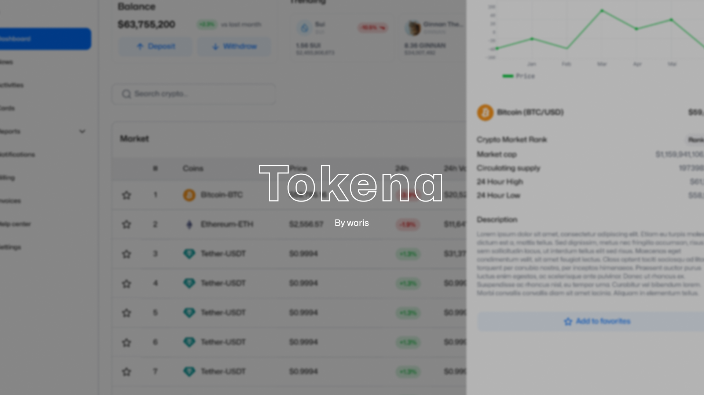

# Cryptocurrency Dashboard

A modern and responsive dashboard for tracking cryptocurrency data, built with [Next.js](https://nextjs.org/), [TypeScript](https://www.typescriptlang.org/), and [Tailwind CSS](https://tailwindcss.com/). The dashboard leverages the [Coingecko API](https://www.coingecko.com/en/api) to provide real-time market data, including prices, market cap, and trading volume for a wide range of cryptocurrencies.

## Cover Picture



_Add a description or caption if needed._

## Features

- **Real-Time Data**: Fetches the latest market data from the Coingecko API, ensuring that the dashboard is always up-to-date.
- **Responsive Design**: Fully responsive layout, optimized for both desktop and mobile devices.
- **TypeScript**: Strongly typed components and logic for enhanced code quality and maintainability.
- **Tailwind CSS**: Customizable and utility-first styling for fast and efficient design.
- **Next.js**: Server-side rendering (SSR) and static site generation (SSG) for optimal performance and SEO.

## Preview

Check out the live preview of the application by following this link : [https://tokena-dashboard.vercel.app/dashboard](https://tokena-dashboard.vercel.app).

## Getting Started

### Prerequisites

- [Node.js](https://nodejs.org/) (v14+)
- [Pnpm](https://pnpm.io)

### Installation

1. Clone the repository:

   ```bash
   git clone https://github.com/Meschack/figma-to-code-ed2-week3.git cryptocurrency-dashboard
   cd cryptocurrency-dashboard
   ```

2. Install dependencies:

   ```bash
   pnpm install
   ```

3. Set up environment variables:

   Create a `.env.local` file in the root of the project and add your configuration. For example:

   ```bash
   NEXT_PUBLIC_COINGECKO_API_KEY=YOUR_COINGECKO_API_KEY
   ```

4. Start the development server:

   ```bash
   pnpm run dev
   ```

   The application should now be running on [http://localhost:3000](http://localhost:3000).

### Build

To create a production build:

```bash
pnpm run build
```

### Deployment

The project is ready to be deployed on platforms like Vercel, Netlify, or any server that supports Node.js.

## Contributing

Contributions are welcome! Please feel free to submit a pull request or open an issue.

## License

This project is licensed under the MIT License. See the [LICENSE](LICENSE) file for details.

## Acknowledgments

- [Coingecko API](https://docs.coingecko.com/v3.0.1/reference/introduction) for providing cryptocurrency data.
- [Figma](https://www.figma.com/design/FHEN8l5THsabutI06zIgON/Tokena?node-id=0-1&t=OqqOP4nhxQQGVZ78-1) for the design of this dashboard.
- The open-source community for the amazing tools and libraries.
